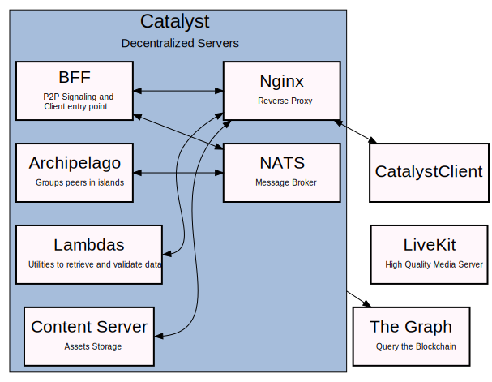

# Catalyst Project

A Catalyst is a server that runs different services. These services currently work as the backbone for Decentraland.

If you just want to run a Catalyst server, please check the [Catalyst Owner](https://github.com/decentraland/catalyst-owner) repository. This repository is mostly used for developing.

The architecture of the server is as follows:



- [Comms](comms): The Communication Service, also known as Lighthouse, is in charge of orchestrating the P2P networks between users connected to Decentraland.
It needs to determine which are the candidates for a P2P connection and do the WebRTC signaling to establish the connection. Most of this logic is done through 2 external components the [PeerJS Server](https://github.com/decentraland/peerjs-server) (connects WebRTC peers) and [Archipelago](https://github.com/decentraland/archipelago) (receives users positions and groups them in islands)

- [Lambdas](lambdas): This service provides a set of utilities required by the Catalyst Server Clients/Consumers in order to retrieve or validate data.
Some of the validations run in these functions are ownership related and for that it uses [The Graph](https://thegraph.com/hosted-service/subgraph/decentraland/collections-matic-mainnet) to query the blockchain.

- [Content Server](content): The Content Server currently stores many of the [Entities](https://github.com/decentraland/common-schemas/tree/main/src/platform) used in Decentraland. For example scenes, wearables and profiles. Content Servers will automatically sync with each other, as long as they were all approved by the [DAO](http://governance.decentraland.org/). If you set up a local content server, it will receive all updates by those other DAO Catalysts. However, new deployments that happen on your local server will not be sent to other servers.
- [Nginx](https://nginx.org/en/docs/) is the reverse proxy used to route traffic to the Catalysts Services.

The [Catalyst Client](https://github.com/decentraland/catalyst-client) library can be used to interact with the Catalyst servers. You can both fetch data, or deploy new entities to the server you specify.

## Catalyst API

This Server implements the v1 of the API Specification detailed [here](https://github.com/decentraland/catalyst-api-specs)

## Monitoring

For monitoring see [the following doc](docs/MONITORING.md)

## Tests

```
yarn build
yarn test
```

## Contributions

If using Visual Studio, please download:

- [`prettier` extension](https://marketplace.visualstudio.com/items?itemName=esbenp.prettier-vscode)
- [`eslint` extension](https://marketplace.visualstudio.com/items?itemName=dbaeumer.vscode-eslint)

### Install Husky

```
yarn add husky
yarn husky install
yarn husky add .husky/pre-commit "yarn lint-staged"
```


## Release

- Modify the version in https://github.com/decentraland/catalyst/blob/master/Dockerfile#L30
- Create a tag release in Git with the same version
