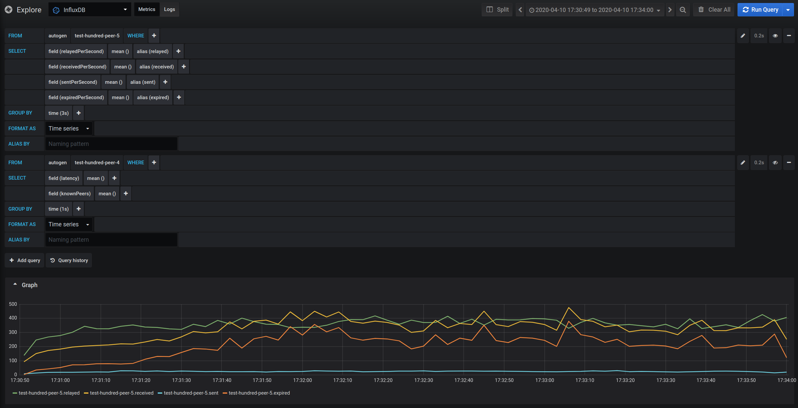

# Catalyst Peer Distributed Performance Tests

# Table of Contents
1. [Introduction](#introduction)
2. [Test components](#test-components)
    1. [Client](#client)
        1. [Headless browser scripts](#headless-browser-scripts)
        2. [Peer routines](#peer-routines)
        3. [Docker Image](#docker-image)
    2. [Test Results Server](#test-results-server)
        1. [Results Server API](#results-server-api)
    3. [Lighthouse](#lighthouse)
    4. [Graphana and InfluxDB](#graphana-influxdb)
3. [Running the tests](#running-the-tests)
    1. [Running them on Amazon](#running-them-on-amazon)
        1. [Updating the components when source changes](#updating-the-components-when-source-changes)
    2. [Running them locally](#running-them-locally)
        1. [Script to run all](#script-to-run-all)
        2. [Running the test server](#running-the-test-server)
        3. [Creating the test](#creating-the-test)
        4. [Running the clients](#running-the-clients)
            1. [Using docker](#using-docker)
            2. [Using the devserver and browser or Puppeteer](#using-the-devserver-and-browser-or-puppeteer)
        5. [Finishing the test](#finishing-the-test)
    3. [Viewing the results](#viewing-the-results)
        1. [Graphana](#graphana)
        2. [Results JSON](#results-json)
4. [Pending improvements](#pending-improvements)

## Introduction

In order to be able to see the impact of the optimizations and configuration changes made in the peer library, there is a need to have comparable results between the different changes.

One way to have comparable results is to have an automated test. This part of the repository tries to be that automated test.

The main difficulty about automating this test is the resources required to run a significant amount of peers are quite a lot, and most computers cannot handle the load, effectively voiding the results. So in order to be able to produce meaningful results, the test needs to be distributed.

The Catalyst Peer Distributed Performance Tests is a suite components and scripts that allow running this test using docker containers in the cloud, and to collect and make sense of the results.

## Test components

### Client

The client is the part of the suite that actually runs the peer library and the test.

It consists of a simple browser application that connects to a provided Lighthouse, joins the `blue` layer and the `room` room and starts sending comms messages, according to a [routine](#peer-routines) that it runs. It also periodically collects statistics and sends them to a provided [results server](#test-results-server). The collected statistics are time based. Each statistic is considered a data point to be analyzed in a time based dashboard or query interface, like Graphana.

Its source code can be found in the [client](client) folder.

In order to run the client, there are two possibilities: [Running a local dev server](#using-the-dev-server-and-browser) and using any browser that supports WebRTC or running it through [docker](#using-docker-or-puppeteer).

#### Headless browser scripts

Since the client is a browser application, it needs a browser to run. This can make it harder to run it in a distributed environment. In order to be able to run the client in CLIs, and in order to be able to easily spin up multiple browsers for the test, the client component uses [Puppeteer](https://github.com/puppeteer/puppeteer).

There is a script that spins up the clients can be found in [run-clients.ts](run-clients.ts). By default it reads some parameters from the environments variables and spins 10 clients, passing those parameters to them. This script, along with the devserver, is the base for the [docker image](#docker-image)

#### Peer routines

The client uses an abstraction called `routine` to try to represent a particular behaviour of a simulated peer. The idea is to have different routines and to be able to configure each simulated peer with different routines in order to test the behaviour of the library when the peers perform different actions.

In the code, a routine is just a function that has the following type:

```typescript
type Routine = (elapsed: number, delta: number, peer: SimulatedPeer) => void;
```

It gets executed every "tick" of the client, wich should be around 60 times per second. The `elapsed` parameter is the time since the start of the simulation, and the `delta` parameter is the time that passed since the last tick. With that information, a routine can update 

At the time of writing this doc, only one routine was implemented and it just sends position messages every 100 ms, profile messages every 1000 ms, and chat messages every 10000 ms. See the [client/index.ts](client/index.ts) file to see how this routine was implemented.

#### Docker Image

In order to be able to run the clients easily on other computers without having to configure a development environment, a docker image was created. This image runs the devserver and then the [run-clients.ts](run-clients.ts) script.

The image is currently published in the `pablitar/peer-performance-test-client` repository on Dockerhub, but it should be moved in the future.

For more information about the image, see its [dockerfile](clientRunner.Dockerfile) and its [entrypoint](client_entrypoint.sh). Also see the section [Using docker](#using-docker) for more information about how to pass parameters to the clients.

The docker image needs to be updated each time there is a code change, either on the client or the peer library. In order to do that, you need to run the [prepare_for_client_docker_image.sh](prepare_for_client_docker_image.sh) script and then run `docker build` with the aforementioned docker file:

```bash
docker build . -f clientRunner.Dockerfile
```

### Test Results Server

Since the test is distributed, the results need to be collected by a centralized server. The Test Results Server is that component.

It is a simple express application with an API that the clients use to submit their statistics. It also allows the creation, starting, and finishing of testing. A test can be created and not started because the clients use that as a signal to start their routines.

Once the tests are finished, their results are stored in the file system. By default, they are stored in the user's home folder, in a subfolder called `peer-performance-tests`.

The results server also relays the datapoints to a configured InfluxDB ingester, so they can be visualized as they are received.

#### Results Server API

- `POST /test/{testId}` -> Creates a test with a provided test id. You can provide the JSON body `{"started": true}` to start the test immediately.
- `POST /test` -> Creates a test with a random test id. The id is returned in the response body. You can provide the JSON body `{"started": true}` to start the test immediately
- `PUT /test/{testId}/start` -> Starts a test
- `PUT /test/{testId}/finish` -> Finishes a test. Once a test is finished it is persisted in the file system. Returns the test status including its dataPoints
- `GET /test/{testId}[dataPoints={boolean}]` -> Returns the current status of a particular test. If the optional query parameter `dataPoints=true` is provided, then all the data points are returned in the response body. This can be quite big

### Lighthouse

The clients need a lighthouse to start communicating with each other. Because they don't have authentication, the lighthouse needs to be brought up with the env variable `NO_AUTH=true`.

### Graphana and InfluxDB

The Test Results Server relays the datapoints it receives to a configured InfluxDB so it can be viewed with a visualizer like Graphana.

Both can be run as docker images: 

`docker run --name influxdb -d -v /var/lib/influxdb:/var/lib/influxdb --restart always -p 8086:8086 -p 8088:8088 influxdb`

and

`docker run -d --restart always -p 3003:3000 --name=grafana -v /var/lib/grafana:/var/lib/grafana grafana/grafana`

Once running, InfluxDB needs to be configured as a datasource for Graphana, and also needs to be exposed so the results server can submit data to it. The results server writes to a database named `comms` using the `write` API.

## Running the tests

Since there is various components, there are several ways to run the tests. The minimum requirements to run a test are:
- A machine capable of running the clients, through its own browser or through puppeteer
- A Test Results Server running somewhere accessible by the clients
- A Lighthouse server running with `NO_AUTH=true` somewhere accessible by the clients
- Optionally, an InfluxDB with a `comms` database to receive the results.

The way this services are provided can vary from test to test. A local test is useful to develop routines and to check that the framework is producing readable results. A distributed cloud test is useful to have a significant amount of clients and to see how the system performs in that situation.

### Running them on AWS

The best way to run the test on AWS is to use Fargate for the clients. The Test Results Server and Lighthouse can also be run on AWS. EC2 works as an option. But they can be run in any location that is accessible by the clients.

The docker image to run in Fargate is the one defined in the [docker image](#docker-image) section. It needs the following environment variables to be set:
- `LIGHTHOUSE_URL`: Where the Lighthouse with `NO_AUTH=true` is running
- `RESULTS_SERVER_URL`: URL pointing to an accessible Test Results Server
- `TEST_ID`: Id of the test created in the Test Results Server

Optionally you can also set the `PEERS_COUNT` variable to change the number of browsers that are going to be run in that container (it defaults to 10), and the `TEST_DURATION` variable to change the duration in seconds for wich the routine is going to be executed (it defaults to 180).

Once the task definition is created, you can run the test as a task in Fargate.

### Running them locally

For development purposes, and for small scale tests, it may be useful to run a test, in a local machine. There are several ways to do this too.

#### Script to run all

There is a script that runs all the dependencies of the test, and then a test in the local machine, and then kills all. It is the easiest way to run the test. It can be found in the [run-local-test.ts](run-local-test.ts) file.

You can set the variable `BROWSER_COUNT` to specify how many browsers the script will create. Currently it defaults to 10.

The script can be run using bazel:

```bash
bazel 'run' '//comms/performance-test:run-local-test'
```

The results of the test can be found in the default folder: `{user-home-dir}/peer-performance-tests`. You'll also be able to find the results in the configured InfluxDB/Graphana

The script uses local source code to run all. That means that every component is always up to date. This script is very useful to run a quick test and see if everything works more or less as expected.

#### Running the test server

To start the test server, you can run the following bazel script

```bash
bazel 'run' '//comms/performance-test/server'
```

You can provide the following optional environment variables to change default configurations:
- `STATS_SERVER_URL`: URL of the InfluxDB database to write to
- `TEST_RESULTS_LOCATION`: Path of the folder where the test results will be persisted when finished

#### Creating and starting a test

Before running the tests, it is necessary to create a test and obtain or define a test id that will be provided to the clients.

In order to do that, use the [Results Server API](#results-server-api).

Once the test has been created, and **all the clients are running and awaiting** for the test to start, you can start the test using the same API.

You could also start the test before, but that will mean that the peers will start performing their routines as soon as they are loaded, and that could lead to a test in which some peers finish their routines and exit earlier than others.

#### Running the clients

The clients can also be run in multiple ways. See below.

##### Using docker

The easiest but less transparent way to run the clients is to use the docker image. You can run them using the following command:

```bash
 docker run -it --rm -e TEST_ID=... -e RESULTS_SERVER_URL=... -e LIGHTHOUSE_URL=... -e PEERS_COUNT=... 
```

The downside of the docker image is that it needs to be updated everytime the code changes. See the section [docker image](#docker-image) for more information.

##### Using the devserver and browser or puppeteer

This is the most convenient way to run the clients locally and have them up to date. It also allows running the clients in any compatible browser, which is useful for debugging and developing.

The client is a Typescript app that is compiled to run in the browser. Currently it is configured with bazel.

There is a bazel build that you can run in order to have a devserver that serves the compiled application:

```bash
bazel 'run' '//comms/performance-test/client:devserver'
```

Once it is up, it will listen for requests in the port 7654.

Then one can go to the http://localhost:7654 URL to start running the client. It supports various parameters through query string in the URL, namely:
- `testDuration`: The duration of the test in seconds. It defaults to 180
- `statsSubmitInterval`: The interval between datapoints submissions to the test server, in milliseconds. It defaults to 2000
- `lighthouseUrl`: The lighthouse url to use. It defaults to http://localhost:9000
- `statsServerUrl`: The Test Results Server url. It defaults to http://localhost:9904
- `testId`: The test id. It doesn't have a default. If not provided, the test will run but no results will be submitted.

For example, to run the client against a local environment with a particular testId you'd go to:

`http://localhost:7654/?testId={your-test-id}`

Additionally, you can run the clients using puppeteer. The main advantage of using puppeteer is the ability to create multiple browsers, to ensure that they are running in different processes and not limited by each other, only by the resources of the machine.

To run the clients with puppeteer, you can use the [run-clients.ts](run-clients.ts) script, using bazel. Example invocation:

```bash
TEST_DURATION=10 TEST_ID=myTest RESULTS_SERVER_URL=http://localhost:9904 CLIENT_URL=http://localhost:7654 LIGHTHOUSE_URL=http://localhost:9000 bazel 'run' '//comms/performance-test:run-clients'
```

#### Finishing the test

After all the clients are finished with their routines, the test can be finished. Once finished it gets persisted in the file system where it can be inspected. You can also get the JSON including the datapoints of the test using the [API](#results-server-api).

### Viewing the results

The results produced are actually a collection of datapoints that need to be analyzed to produce meaningful results. Currently, there are a couple of ways to analyze them.

#### Graphana

If the test results server is configured to push its data to an InfluxDB, then Graphana can be used to visualize the information. You can use the explore tab, or create dashboards.

Example on the explore tab:



#### Results JSON

The results JSON is big but simple. It has the following structure:
```typescript
{
  "id": string, // Test id
  "dataPoints": [ // List of dataPoints collected
    {
      "peerId": string, 
      "timestamp": number, // Timestamp of the datapoint, when it was received
      "metrics": {
        "sent": number, // Number of packets sent in the last stats window
        "sentTotal": number, // Total packets sent since the beginning of the test
        "sentPerSecond": number, // Packets sent per second
        "sentBytes": number, // Bytes sent in the last stats window
        "sentTotalBytes": number, // Total bytes sent since the beginning of the test
        "sentBytesPerSecond": number, // Bytes sent per second in the last stats window
        "sentAveragePacketSize": number, // Average packet size of the packages since the start of the test
        "received": number, // Same as above but with received packets
        "receivedTotal": number,
        "receivedPerSecond": number,
        "receivedBytes": number,
        "receivedTotalBytes": number,
        "receivedBytesPerSecond": number,
        "receivedAveragePacketSize": number,
        "relayed": number, // Same as above but with relayed packets. Relayed packets do not count as sent
        "relayedTotal": number,
        "relayedPerSecond": number,
        "relayedBytes": number,
        "relayedTotalBytes": number,
        "relayedBytesPerSecond": number,
        "relayedAveragePacketSize": number,
        "all": number, // Same as above counting all the packets
        "allTotal": number,
        "allPerSecond": number,
        "allBytes": number,
        "allTotalBytes": number,
        "allBytesPerSecond": number,
        "allAveragePacketSize": number,
        "relevant": number, // Same as above counting only those packets that were intended for rooms where the peer has joined
        "relevantTotal": number,
        "relevantPerSecond": number,
        "relevantBytes": number,
        "relevantTotalBytes": number,
        "relevantBytesPerSecond": number,
        "relevantAveragePacketSize": number,
        "duplicate": number, // Same as above counting packet duplicates that arived
        "duplicateTotal": number,
        "duplicatePerSecond": number,
        "duplicateBytes": number,
        "duplicateTotalBytes": number,
        "duplicateBytesPerSecond": number,
        "duplicateAveragePacketSize": number,
        "expired": number, // Same as above counting expired packets that arived, be it for them ariving unordered or because they are old
        "expiredTotal": number,
        "expiredPerSecond": number,
        "expiredBytes": number,
        "expiredTotalBytes": number,
        "expiredBytesPerSecond": number,
        "expiredAveragePacketSize": number,
        "connectedPeers": [string], // Which peers this peer is connected to
        "knownPeersCount": number, // How many peers it knows
        "position": [ // Peer position
            number,
            number,
            number
        ]
      }
    }
  ],
  "started": number
  "finished": number
}
```

There is currently a simple and hacky html page to be able to have some insights of the metrics using the JSON. You can find it in [test-results-processing/process-test-response.html](test-results-processing/process-test-response.html). It can be opened directly in Chrome or Firefox and you can use their consoles to inspect the JSON.

## Pending improvements
- Move docker image to official DCL repo
- Easier updates to results server and docker image
- A way to measure how "busy" are the peers from the CPU and machine resources standpoint. Maybe measure setTimeout latency?
- Add summarized results and assertions
- Add automation to run the test on AWS
- Improve testing experience overall
- Add more metrics
- Have default dashboards and analytics to compare
