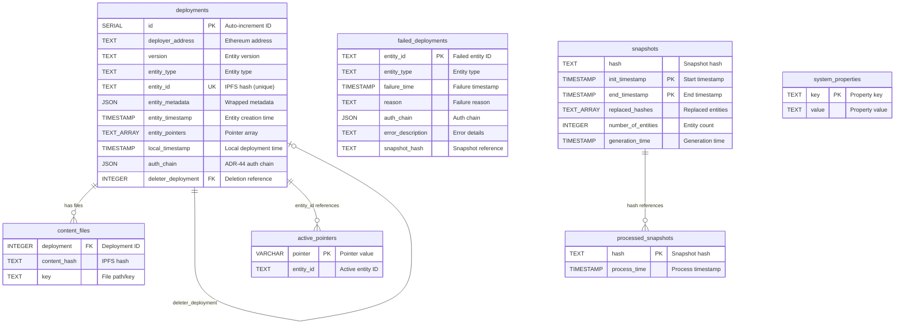

# Database Schema Documentation

This document describes the database schema for the Catalyst Content Server. The schema uses PostgreSQL and is managed through migrations located in `src/migrations/scripts/`.

## Tables Overview

The database contains the following active tables:
1. **`deployments`** - Stores all entity deployments (scenes, wearables, profiles, etc.)
2. **`content_files`** - Links deployments to their content file hashes
3. **`failed_deployments`** - Tracks failed deployment attempts with error information
4. **`active_pointers`** - Maps pointers (coordinates/names) to currently active entity IDs
5. **`snapshots`** - Stores snapshot information for entity synchronization
6. **`processed_snapshots`** - Tracks which snapshots have been processed
7. **`system_properties`** - Key-value store for system configuration

---

## Database Schema Diagram



**Relationship Notes:**
- **Foreign Keys**: `content_files.deployment` → `deployments.id`, `deployments.deleter_deployment` → `deployments.id` (self-reference)
- **Logical References**: `active_pointers.entity_id` references `deployments.entity_id` (not a foreign key)
- **Active Deployments**: A deployment is active when `deleter_deployment IS NULL`
- **Synchronization**: `snapshots` and `processed_snapshots` are used for Catalyst-to-Catalyst sync

---

## Table: `deployments`

Stores all entity deployments (scenes, wearables, profiles, emotes, etc.) deployed to the Catalyst server.

### Columns

| Column               | Type      | Nullable | Description                                                                                 |
| -------------------- | --------- | -------- | ------------------------------------------------------------------------------------------- |
| `id`                 | SERIAL    | NOT NULL | **Primary Key**. Auto-incrementing deployment ID.                                           |
| `deployer_address`   | TEXT      | NOT NULL | Ethereum address of the wallet that deployed the entity.                                    |
| `version`            | TEXT      | NOT NULL | Entity version (e.g., `"v3"`).                                                              |
| `entity_type`        | TEXT      | NOT NULL | Type of entity (`"scene"`, `"profile"`, `"wearable"`, `"emote"`, etc.).                     |
| `entity_id`          | TEXT      | NOT NULL | **Unique**. IPFS hash (CID) of the entity.                                                  |
| `entity_metadata`    | JSON      | NULL     | Entity metadata wrapped in `{ v: <metadata> }` structure. Null if entity has no metadata.   |
| `entity_timestamp`   | TIMESTAMP | NOT NULL | Timestamp from the entity itself (when it was created).                                     |
| `entity_pointers`    | TEXT[]    | NOT NULL | Array of pointers (coordinates like `"10,20"` or world names).                              |
| `local_timestamp`    | TIMESTAMP | NOT NULL | Timestamp when this deployment was recorded locally on this server.                         |
| `auth_chain`         | JSON      | NOT NULL | Authentication chain (array of `AuthLink` objects) following ADR-44.                        |
| `deleter_deployment` | INTEGER   | NULL     | Foreign key to `deployments.id`. If set, this deployment was deleted by another deployment. |

### Indexes

- **Primary Key**: `id`
- **Unique Constraint**: `entity_id` (changed from `(entity_id, entity_type)` in migration 1646919812526)
- **Index**: `deployments_deployer_address_idx` on `deployer_address`
- **Index**: `deployments_entity_type_idx` on `entity_type`
- **Index**: `deployments_entity_pointers_idx` (GIN index) on `entity_pointers` array
- **Index**: `deployments_local_timestamp_idx` (DESC) on `local_timestamp`
- **Index**: `deployments_entity_timestamp_idx` (DESC) on `entity_timestamp`
- **Index**: `deployments_deleter_deployment_idx` on `deleter_deployment` (deprecated, may be removed)

### Entity Metadata Structure

The `entity_metadata` column stores metadata wrapped in a `v` property:

```json
{
  "v": {
    // Actual entity metadata varies by entity type
    // For scenes: worldConfiguration, scene, etc.
    // For wearables: wearable, etc.
    // For profiles: avatars, etc.
  }
}
```

This wrapper allows storing arbitrary metadata structures while maintaining PostgreSQL JSON type safety.

### Auth Chain Structure

The `auth_chain` column stores an array of authentication links:

```json
[
  {
    "type": "SIGNER",
    "payload": "0xd9b96b5dc720fc52bede1ec3b40a930e15f70ddd",
    "signature": ""
  },
  {
    "type": "ECDSA_PERSONAL_EPHEMERAL",
    "payload": "Decentraland Login\nEphemeral address: 0x...\nExpiration: ...",
    "signature": "0x..."
  }
]
```

### Constraints and Business Rules

1. **Entity ID Uniqueness**: Each `entity_id` must be unique across all entity types
2. **Active Deployments**: A deployment is active if `deleter_deployment IS NULL`
3. **Pointer Array**: `entity_pointers` is a PostgreSQL array type, indexed with GIN for efficient queries
4. **Timestamp Handling**: Timestamps are stored in PostgreSQL TIMESTAMP format, converted from milliseconds in code

---

## Table: `content_files`

Links deployments to their content file hashes. Each row represents one content file referenced by a deployment.

### Columns

| Column         | Type    | Nullable | Description                                                                       |
| -------------- | ------- | -------- | --------------------------------------------------------------------------------- |
| `deployment`   | INTEGER | NOT NULL | **Foreign Key** to `deployments.id`.                                              |
| `content_hash` | TEXT    | NOT NULL | IPFS hash (CID) of the content file.                                              |
| `key`          | TEXT    | NOT NULL | File path/key within the deployment (e.g., `"scene.json"`, `"models/scene.glb"`). |

### Indexes

- **Unique Constraint**: `(deployment, key)` - Each deployment can only have one file with a given key
- **Index**: `content_files_content_hash_idx` on `content_hash` (for finding which deployments use a file)

### Business Rules

1. Each deployment can reference multiple content files
2. Each content file is identified by its hash and key combination
3. The `content_hash` index enables efficient queries to find all deployments using a specific file

---

## Table: `failed_deployments`

Tracks deployment attempts that failed validation or processing, preventing re-processing of invalid entities during synchronization.

### Columns

| Column              | Type      | Nullable | Description                                                                         |
| ------------------- | --------- | -------- | ----------------------------------------------------------------------------------- |
| `entity_id`         | TEXT      | NOT NULL | **Primary Key**. IPFS hash (CID) of the failed entity.                              |
| `entity_type`       | TEXT      | NOT NULL | Type of entity that failed.                                                         |
| `failure_time`      | TIMESTAMP | NOT NULL | Timestamp when the failure occurred.                                                |
| `reason`            | TEXT      | NOT NULL | Failure reason code (e.g., `"INVALID_ENTITY"`, `"VALIDATION_ERROR"`).               |
| `auth_chain`        | JSON      | NULL     | Authentication chain from the failed deployment (added in migration 1638045153758). |
| `error_description` | TEXT      | NOT NULL | Human-readable error description.                                                   |
| `snapshot_hash`     | TEXT      | NOT NULL | Hash of the snapshot that contained this failed deployment.                         |

### Indexes

- **Primary Key**: `entity_id`
- **Index**: `failed_deployments_failure_time_idx` (DESC) on `failure_time`

### Business Rules

1. Failed deployments are stored to prevent re-processing during synchronization
2. The `snapshot_hash` links failures to specific synchronization snapshots
3. `auth_chain` may be NULL for older failed deployments (added in migration 1638045153758)

---

## Table: `active_pointers`

Maps pointers (coordinates like `"10,20"` or world names) to their currently active entity IDs. This table is maintained automatically and provides fast lookups for active entities by pointer.

### Columns

| Column      | Type    | Nullable | Description                                                               |
| ----------- | ------- | -------- | ------------------------------------------------------------------------- |
| `pointer`   | VARCHAR | NOT NULL | **Primary Key**. Pointer value (coordinate like `"10,20"` or world name). |
| `entity_id` | TEXT    | NOT NULL | Currently active entity ID for this pointer.                              |

### Indexes

- **Primary Key**: `pointer`
- **Index**: `active_pointers_pointer_ops_idx` (varchar_pattern_ops) on `pointer` for pattern matching

### Business Rules

1. Only one active entity per pointer (enforced by primary key)
2. Updated automatically when deployments are created or deleted
3. Only includes active deployments (where `deleter_deployment IS NULL`)
4. The `varchar_pattern_ops` index enables efficient LIKE pattern matching for pointer queries

---

## Table: `snapshots`

Stores snapshot information used for synchronization between Catalyst servers. Snapshots represent a point-in-time view of all entities.

### Columns

| Column               | Type      | Nullable | Description                                                      |
| -------------------- | --------- | -------- | ---------------------------------------------------------------- |
| `hash`               | TEXT      | NULL     | Hash of the snapshot content.                                    |
| `init_timestamp`     | TIMESTAMP | NOT NULL | **Primary Key (part 1)**. Start timestamp of the snapshot range. |
| `end_timestamp`      | TIMESTAMP | NOT NULL | **Primary Key (part 2)**. End timestamp of the snapshot range.   |
| `replaced_hashes`    | TEXT[]    | NOT NULL | Array of entity hashes that were replaced in this snapshot.      |
| `number_of_entities` | INTEGER   | NOT NULL | Total number of entities in this snapshot.                       |
| `generation_time`    | TIMESTAMP | NOT NULL | Timestamp when the snapshot was generated.                       |

### Indexes

- **Primary Key**: `(init_timestamp, end_timestamp)`
- **Index**: `snapshots_hash_idx` on `hash` (added in migration 1639480263808)

### Business Rules

1. Snapshots represent a time range of entity state
2. Used for synchronization between Catalyst servers
3. The composite primary key ensures unique snapshot ranges

---

## Table: `processed_snapshots`

Tracks which snapshots have been processed by this server, preventing duplicate processing.

### Columns

| Column         | Type      | Nullable | Description                                      |
| -------------- | --------- | -------- | ------------------------------------------------ |
| `hash`         | TEXT      | NOT NULL | **Primary Key**. Hash of the processed snapshot. |
| `process_time` | TIMESTAMP | NOT NULL | Timestamp when the snapshot was processed.       |

### Indexes

- **Primary Key**: `hash`

### Business Rules

1. Once a snapshot hash is recorded, it won't be processed again
2. Used to prevent duplicate synchronization work

---

## Table: `system_properties`

Key-value store for system configuration and state. Used for storing Catalyst server metadata and configuration.

### Columns

| Column  | Type | Nullable | Description                                                        |
| ------- | ---- | -------- | ------------------------------------------------------------------ |
| `key`   | TEXT | NOT NULL | **Primary Key**. Property key name.                                |
| `value` | TEXT | NOT NULL | Property value (stored as text, may represent various data types). |

### Indexes

- **Primary Key**: `key`

### Business Rules

1. Simple key-value store for system configuration
2. Values are stored as TEXT, interpretation depends on the key

---

## Dropped Tables (Historical Reference)

The following tables were created in earlier migrations but have since been dropped:

1. **`deployment_deltas`** - Dropped in migration `1649343059010`
   - Previously tracked pointer changes between deployments
   - Used enum type `delta_pointer_result` with values `['set', 'cleared']`

2. **`migration_data`** - Dropped in migration `1649364923315`
   - Previously stored original metadata for migrations
   - Had columns: `deployment` (FK to deployments), `original_metadata` (JSON)

3. **`last_deployed_pointers`** - Dropped in migration `1707921624880`
   - Previously tracked the last deployment for each pointer/entity_type combination
   - Replaced by `active_pointers` table

4. **`pointer_history`** - Dropped in migration `1707921624880`
   - Previously maintained full history of pointer assignments
   - Had columns: `pointer`, `entity_type`, `deployment` (FK)

5. **`denylist`** - Dropped in migration `1643917932340`
   - Previously stored denylisted entities/content
   - Had columns: `target_type`, `target_id`

6. **`denylist_history`** - Dropped in migration `1643917932340`
   - Previously tracked denylist changes
   - Had columns: `target_type`, `target_id`, `timestamp`, `auth_chain` (JSON), `action`

---

## Related Code

- **Migrations**: `src/migrations/scripts/`
- **Database Queries**: `src/logic/database-queries/`
- **Deployment Logic**: `src/logic/deployments.ts`
- **Types**: `src/deployment-types.ts`
- **Database Port**: `src/ports/postgres.ts`
