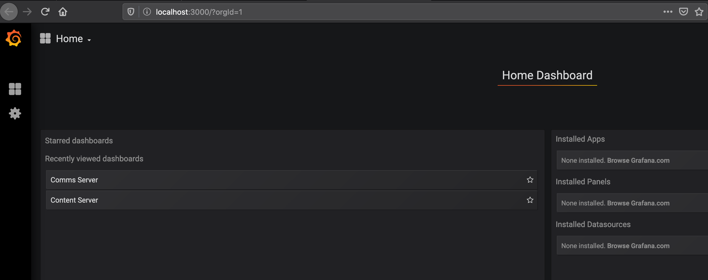

## MONITORING

Both the content and comms service use the env variable `METRICS`, if you set this to `true` both of them will expose an API `/metrics` showing up prometheus-compatible metrics using the [prom-client](https://github.com/siimon/prom-client) lib.

This is enabled by default using the `docker-compose.yml` file, you can see and test the local metrics by entering http://localhost:3000, this is a preconfigured [Grafana](https://grafana.com/) with some pre-baked dashboards.

* `open localhost:3000`

* You will find the following page:

* There you can create new dashboards or edit the preexistent ones, everything  will be done locally and you can test out whatever you want.