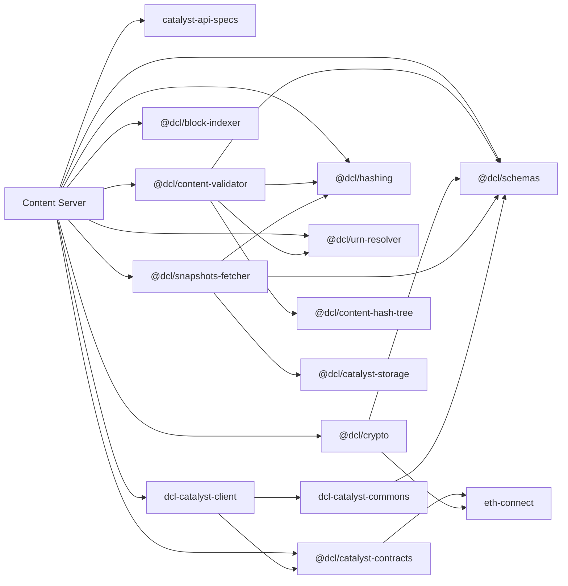
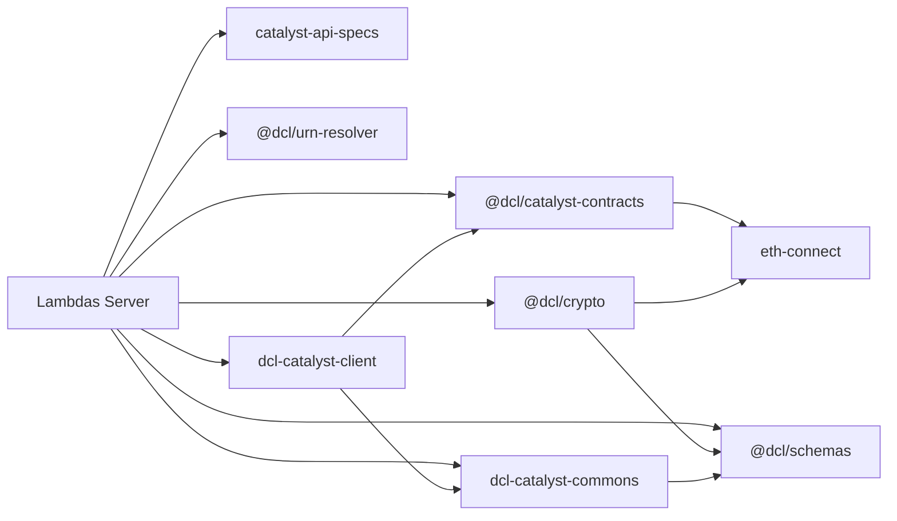

# Content Server dependencies

```mermaid
graph LR

contentserver[Content Server] --> catalystapispecs[catalyst-api-specs]
contentserver --> catalystclient["dcl-catalyst-client"]
contentserver --> catalystcontracts["@dcl/catalyst-contracts"]
contentserver --> contentvalidator["@dcl/content-validator"]
contentserver --> crypto["@dcl/crypto"]
contentserver --> hashing["@dcl/hashing"]
contentserver --> schemas["@dcl/schemas"]
contentserver --> blockindexer["@dcl/block-indexer"]
contentserver --> snapshotsfetcher["@dcl/snapshots-fetcher"]
contentserver --> urnresolver["@dcl/urn-resolver"]
catalystclient --> catalystcommons["dcl-catalyst-commons"]
catalystclient --> catalystcontracts
catalystcontracts --> ethconnect["eth-connect"]
contentvalidator --> contenthashtree["@dcl/content-hash-tree"]
contentvalidator --> hashing
contentvalidator --> schemas
contentvalidator --> urnresolver
crypto --> schemas
crypto --> ethconnect
snapshotsfetcher --> catalyststorage["@dcl/catalyst-storage"]
snapshotsfetcher --> hashing
snapshotsfetcher --> schemas
catalystcommons --> schemas["@dcl/schemas"]

click catalystapispecs href "https://github.com/decentraland/catalyst-api-specs" _blank
click catalystclient href "https://github.com/decentraland/catalyst-client" _blank
click catalystcommons href "https://github.com/decentraland/catalyst-commons" _blank
click catalystcontracts href "https://github.com/decentraland/catalyst-contracts" _blank
click catalyststorage href "https://github.com/decentraland/catalyst-storage" _blank
click contenthashtree href "https://github.com/decentraland/content-hash-tree" _blank
click contentvalidator href "https://github.com/decentraland/content-validator" _blank
click crypto href "https://github.com/decentraland/decentraland-crypto" _blank
click ethconnect href "https://github.com/decentraland/eth-connect" _blank
click hashing href "https://github.com/decentraland/hashing" _blank
click schemas href "https://github.com/decentraland/common-schemas" _blank
click snapshotsfetcher href "https://github.com/decentraland/snapshots-fetcher" _blank
click urnresolver href "https://github.com/decentraland/urn-resolver" _blank
click catalystcommons href "https://github.com/decentraland/catalyst-commons" _blank
```

# Lambdas Server dependencies

```mermaid
graph LR

lambdasserver["Lambdas Server"] --> catalystapispecs["catalyst-api-specs"]
lambdasserver --> catalystcontracts["@dcl/catalyst-contracts"]
lambdasserver --> crypto["@dcl/crypto"]
lambdasserver --> schemas["@dcl/schemas"]
lambdasserver --> urnresolver["@dcl/urn-resolver"]
lambdasserver --> catalystclient["dcl-catalyst-client"]
lambdasserver --> catalystcommons["dcl-catalyst-commons"]
catalystclient --> catalystcommons
catalystclient --> catalystcontracts
catalystcontracts --> ethconnect["eth-connect"]
crypto --> schemas
crypto --> ethconnect
catalystcommons --> schemas["@dcl/schemas"]

click catalystapispecs href "https://github.com/decentraland/catalyst-api-specs" _blank
click catalystclient href "https://github.com/decentraland/catalyst-client" _blank
click catalystcommons href "https://github.com/decentraland/catalyst-commons" _blank
click catalystcontracts href "https://github.com/decentraland/catalyst-contracts" _blank
click crypto href "https://github.com/decentraland/decentraland-crypto" _blank
click ethconnect href "https://github.com/decentraland/eth-connect" _blank
click schemas href "https://github.com/decentraland/common-schemas" _blank
click urnresolver href "https://github.com/decentraland/urn-resolver" _blank
click catalystcommons href "https://github.com/decentraland/catalyst-commons" _blank
```
